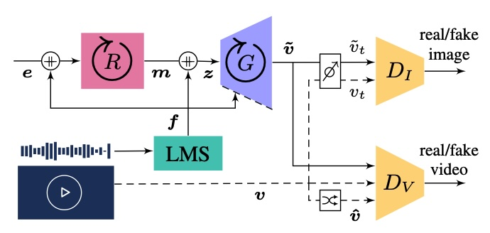

# Listen and Move: Improving GANs Coherency in Agnostic Sound-to-Video Generation

[Project Page](https://multimedia-eurecat.github.io/2023/10/03/listen-and-move-gan.html) | [Abstract Paper](https://av4d.org/papers/iccv23/p4.pdf) | [Full Paper](https://arxiv.org/pdf/2406.16155)


This repository contains the code for training a particular type of Generative Adversarial Network (GAN) for transforming audio (actually a sequence of spectrograms) into a video sequence. In particular, compared to a vanilla GAN, it makes use of:

1. A more versatile triple sound routing for motion encoding, content representation, and conditional normalization layers.
2. A residual multi-scale DilatedRNN for an extended audio analysis and listening range.
3. A multi-orientation causal video prediction layer built upon a novel Directional ConvGRU.

This repository also contains a wide range of GAN configurations, losses, and validation metrics.




[Rafael Redondo](https://valillon.github.io), "[Listen and Move: Improving GANs Coherency in Agnostic Sound-to-Video Generation](https://av4d.org/papers/iccv23/p4.pdf)" In ICCV 2023 workshop: AV4D Visual Learning of Sounds in Spaces.

# Main Content

- `assets.py`: A folder containing training videos and deploy audio files.
- `converter.py`: Audio converter, takes an audio file (filename or raw audio) and generates a bunch of spectrograms according to a given hop size.
- `datasets.py`: Contains a dataloader which takes a video file as input and generates frame pairs of video and spectrogram or audio features according to requested fps (makes use of `converter.py`). The dataloader dispatches training batches of short video sequences and associated spectrograms or audio features (e.g. 4, 8, 16,...).
- `modules.py`: Neural models. See architectures.
- `convgru.py`: Implements a ConvGRU Cell with bidirectional kernels.
- `train.py`: Main setup and training iterations.
- `losses.py`: This class computes several loss types: wgan-gp, wgan, hinge, non-saturating, least-squares, total variation, and BCELogistics.
- `fid.py` and `fvd.py`: Code for calculating the Frechet Inception Distance (FID) and Frechet Video Distance (FVD) of the generated frames.
- `logger.py`: Writes configuration and training losses on a log file and TensorBoard.
- `deploy.py`: File to deploy videos on the fly during training and off-line provided a list of validation audio files.
- `eval_models.py`: Plots MSE (mean, std) over long synthetic videos vs reals, e.g. 512-1024 frames, to assess performance on sequence length.

# How to train

Use `train.py` for training a model in a particular video by using the following arguments. Consult the paper for further details.

### General arguments
`--gpus`: Specifies which GPUs to use. Default is '0'.  
`--train_source`: Path to the training video source file (or URMP+split+instrument).  
`--trial_name`: Name of the trial for logging and checkpointing purposes.   
`--resume`: Path to the deploy folder to resume training. Default is an empty string.   

### Video settings
`--seq_len`: Length of the video sequence in frames. Default is 32.   
`--fps`: Frame rate of the video. Default is 20.   

### Sound representation
`--chunk_len`: Duration of audio chunks in seconds. Must be greater than or equal to 0.16. Default is 0.085.   
`--feat_type`: Type of sound feature descriptors to use. Options are 'mel', 'lms', or 'mfcc'. Default is 'lms'.   
`--mel_bands`: Number of Mel bands. Typically 64 or 128. Default is 64.   

### Conditioning configurations
`--e_motion`: Size of the motion random vector that feeds the RNN. Default is 2.   
`--z_content`: Size of the noise content that feeds the generator. Default is 0.   
`--sound_route`: Specifies how sound features are routed. Options are 'rnn', 'gen' (generator), or 'rnngen' (both). Default is 'gen'.   
`--motion_layers`: Number of motion encoder layers. Default is 1.   
`--motion_type`: Type of recurrent motion encoding. Options are 'basic' or 'feedback'. Default is 'basic'.   

### Image and video synthesis
`--image_size`: Size of the video frame. Default is 256.   
`--crop`: Video frame cropping coordinates at loading. Default is None.   
`--g_type`: Type of generator. Options are '2d' (residual) or '3d'. Default is '2d'.   
`--g_arch`: Architecture of the generator. Options are 'basic', 'skip', or 'residual'. Default is 'residual'.   
`--d_arch`: Architecture of the discriminators. Options are 'basic', 'skip', or 'residual'. Default is 'skip'.   
`--vid_pred`: Type of video prediction. Options are None (empty), 'basic', or 'dir' (directional). Default is empty.   
`--double_finest`: If given, doubles the channel capacity of the finest (outer) G and D layers.   
`--cond_gen`: If given, activates the generator's conditional instance normalization.   

### Hyperparameters
`--total_iter`: Total number of iterations to train. Default is 50000.   
`--loss_type`: Type of cost function. Options are 'wgan-gp' (Wasserstein-GP), 'wgan', 'hinge', 'ns' (non-saturating), 'ls' (least-squares), 'bce' (BCELogistics). Default is 'wgan-gp'.   
`--lr_g`: Learning rate for the generator. Default is 1e-4.   
`--lr_d`: Learning rate for the discriminator. Default is 4e-4.   
`--lambda_L1`: Weight factor for L1 loss term. Set to 0 to disable. Default is 0.   
`--lambda_pl`: Weight factor for perceptual loss. Set to 0 to disable. Default is 10.   


## Training automation

The script `train.sh` automates the training process. It iterates over a predefined set of assets, names, and crops,
and invokes the training function with the appropriate parameters.  
Usage:
```sh
  ./train.sh <number_of_gpus> <train_source> <trial_name> <sound_route> <motion_layers> <motion_type> <image_size> <video_prediction> <crop> <total_iter>
```
Example:
```sh
  ./train.sh 1 ./assets/myvideo.mp4 myname rnn 1 basic 128 "" 650,400,1250,1000 50000
```

# How to deploy

Use `deploy.py` to deploy a trained model with different audio files by using the following arguments. Consult the paper for further details.

`--gpus`: Specifies which GPUs to use. Default is '0'.   
`--checkpoint`: Path to the generators checkpoint file. Default is None.   
`--seq_len`: Length of the video sequence in frames. Default is 32.   
`--fps`: Frame rate of the video. Default is 20.   
`--chunk_len`: Duration of audio chunks in seconds. Must be greater than or equal to 0.16. Default is 0.085.   
`--feat_type`: Type of sound feature descriptors to use. Options are 'mel' (mel spectrogram) or 'mfcc'. Default is 'mel'.   
`--mel_bands`: Number of Mel bands. Typically 64 or 128. Default is 64.   
`--e_motion`: Size of the motion random vector that feeds the RNN. Default is 2.   
`--z_content`: Size of the noise content that feeds the generator. Default is 0.   
`--sound_route`: Specifies how sound features are routed. Options are 'rnn', 'gen' (generator), or 'rnngen' (both). Default is 'gen'.   
`--motion_layers`: Number of motion encoder layers. Default is 1.   
`--motion_type`: Type of recurrent motion encoding. Options are 'basic' or 'feedback'. Default is 'basic'.   
`--image_size`: Size of the video frame. Default is 256.   
`--g_type`: Type of generator. Options are '2d' (residual) or '3d'. Default is '2d'.   
`--g_arch`: Architecture of the generator. Options are 'basic', 'skip', or 'residual'. Default is 'residual'.   
`--vid_pred`: Type of video prediction. Options are None (empty), 'basic', or 'dir' (directional). Default is empty.   
`--double_finest`: If given, doubles the channel capacity of the finest (outer) G and D layers.   
`--cond_gen`: If given, activates the generator's conditional instance normalization.   

Example of how to deploy a trained model:    

```sh
python deploy.py \
    --gpus 0 \
    --checkpoint 20221115162523-experiment128/checkpoints/0040000_Gn.model \
    --vp_channels 8 \
    --motion_layers 3 \
    --sound_route rnngen \
    --seq_len 32 \
    --e_motion 2 \
    --z_content 0 \
    --fps 10 \
    --chunk_len 0.150 \
    --mel_bands 64 \
    --feat_type lms \
    --image_size 256 \
    --g_arch residual
```

# How to validate

Run the script `scripts/eval_models.py` on custom audio files or `scripts/eval_FSD50K.py` on sounds from the [FSD50K dataset](https://annotator.freesound.org/fsd/release/FSD50K/) to evaluate the quality of generated video sequences using various metrics: FVD, FID, MSE, PSNR, SSIM, and LPIPS. The performance of different model checkpoints can be compared and visualized. See `scripts/eval_models.sh` and `scripts/eval_FSD50K.sh` for some examples.

`--train_source`: Path to the training source, which can be a video file or a URMP+split+instrument.   
`--checkpoints`: List of paths to checkpoints. Default is None.   
`--labels`: List of checkpoint names. Default is None.   
`--image_size`: Size of the video frame. Default is 256.   
`--crop`: Video frame cropping coordinates at loading. Default is None.   
`--max_seq_len`: Maximum sequence length to evaluate. Default is 1024.   
`--fps`: Frame rate of the video. Default is 20.   
`--chunk_len`: Duration of audio chunks in seconds. Must be greater than or equal to 0.16. Default is 0.085.   
`--feat_type`: Type of sound feature descriptors to use. Options are 'mel', 'lms', or 'mfcc'. Default is 'lms'.   
`--mel_bands`: Number of Mel bands. Typically 64 or 128. Default is 64.   
`--e_motion`: Size of the motion random vector that feeds the RNN. Default is 2.   
`--z_content`: Size of the noise content that feeds the generator. Default is 0.   
`--sound_route`: Specifies how sound features are routed. Options are 'rnn', 'gen' (generator), or 'rnngen' (both). Default is 'gen'.   
`--motion_layers`: Number of motion encoder layers. Default is 1.   
`--motion_type`: Type of recurrent motion encoding. Options are 'basic' or 'accumulative'. Default is 'basic'.   
`--g_type`: Type of generator. Options are '2d' (residual) or '3d'. Default is '2d'.   
`--g_arch`: Architecture of the generator. Options are 'basic', 'skip', or 'residual'. Default is 'residual'.   
`--vid_pred`: Type of video prediction. Options are None (empty), 'basic', or 'dir' (directional). Default is empty.   
`--double_finest`: If given, doubles the channel capacity of the finest (outer) G and D layers.   
`--cond_gen`: If given, activates the generator's conditional instance normalization.   
`--save_plot`: Metric to be plotted. Options are 'none', 'mse', 'psnr', or 'ssim'. Default is an empty string.   

# Citation

````
@inproceedings{redondo2023gans,
  title={Listen and Move: Improving GANs Coherency in Agnostic Sound-to-Video Generation},
  author={R. Redondo},
  year={2023},
  booktitle={AV4D: Visual Learning of Sounds in Spaces. ICCV Workshop, Oct. 2023.},
}
````

---
    Copyright (c) 2023 Rafael Redondo, Eurecat.